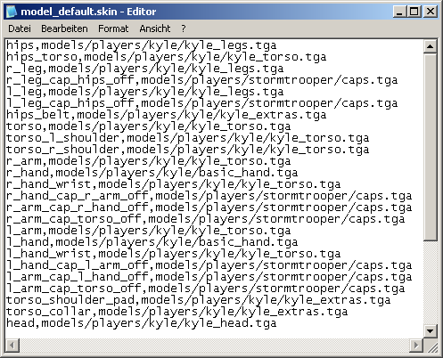

# Hiding Model Parts

## Goal

This tutorial explains how you can create a skin in which certain parts of the model are not displayed. This tutorial applies to JK2 and has an appendix for JKA.

## Prerequisites

- A file archiver like [7-Zip](http://www.7-zip.org/)
- A text editor like Notepad

## Steps

1. [Unpack skin File](#unpack-skin-file)
2. [What Are skin Files?](#what-are-skin-files)
3. [Write a surf File](#write-a-surf-file)
4. [Packing](#packing)
5. [Appendix for JKA](#appendix-for-jka)

### Unpack skin File

First, we need the \*.skin file of a skin in which we want to deactivate parts. These can be found in *assets0.pk3*, which you can open with an archiver.

I decided to use the Kyle skin in this tutorial, so I extracted the *model_default.skin* file to the base folder of my Jedi Knight 2 installation. But it doesn't matter where you extract it to. The subfolder *models/players/kyle* now contains the *model_default.skin* file, which you can now open with a text editor.

### What Are skin Files?

The skin file should be familiar to old Skinner hands, but I'll explain how it works again here.

Everything in front of a comma is a part of the model that consists of polygons. After the comma is the path to the texture that belongs to the respective model part. A model part that ends in *_off* is not displayed by the game engine by default. Parts that have a *_cap_* in their name lie exactly between the model parts that are before and after the *_cap_*.

#### Small example

Between *l_hand* and *l_arm* is *l_hand_cap_l_arm_off* but in between is also *l_arm_cap_l_hand_off*. This is because *l_hand_cap_l_arm_off* should cover the end of *l_hand* to *l_arm* and the end of *l_arm* to *l_hand* would be covered by *l_arm_cap_l_hand_off*. The naming of these parts therefore follows the scheme `<parent_surface>_cap_<facing_surface>`.

### Write a surf File

We will now make a Kyle skin in which the left arm is completely deactivated. To do this, we need a \*.surf file. This must always have the same name as the \*.skin file to which it belongs.

Create a new \*.txt file and rename it to *model_default.surf*. Now write this text in it:

    surfOff "l_hand l_hand_wrist l_arm"
    surfOn "torso_cap_l_arm_off"
   
A \*.surf file has a very simple structure. There are only 2 commands (`surfOff` / `surfOn`), after which the affected model parts are separated by spaces in double quotation marks.

`surfOff` deactivates the model parts. So if we don't want Kyle's entire left arm, we have to "switch off" his hand and arm. So, as shown in the file above, we write all parts beginning with *l_hand* and *l_arm* in the line of `surfOff`. All except the parts on *_off*, because they are not shown anyway. If we stopped now, you could see into Kyle's body through the left shoulder later in the game. We still have to activate the right *_cap_* part. We have `surfOn` for this. Here we enter the part that limits the upper body (torso) to the arm. Now save the file in the *kyle* folder, which should be in *base/models/players*. If it does not exist, create it. The \*.surf file must always be in the same folder as the \*.skin file. If there is anything else in the *kyle* folder, you can probably delete it.

### Packing

Now you have to save everything in a \*.pk3 file. To do this, create a \*.zip file and save your *surf* file in it with the correct path (*models/players/kyle*). Then simply rename the \*.zip file to \*.pk3. The pk3 should look like this:

Now you just have to put the \*.pk3 file into the base folder of your JK2 installation. In the game it will look like this:

### Appendix for JKA

In Jedi Academy, it is no longer necessary to create a \*.surf file for `surfOff`. You can control the deactivation directly in the \*.skin file. The result from above is achieved in JKA like this:

So you do not write the path to a texture after the model part but `*OFF`. However, there is no equivalent command for `surfOn`, so you have to write a \*.surf file for it.

Unfortunately, there seems to be something wrong with the path information in the model_default.skin file, which is why you see a gray texture on the shoulder in the game.
