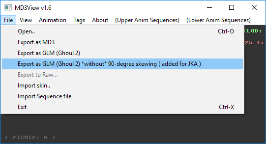
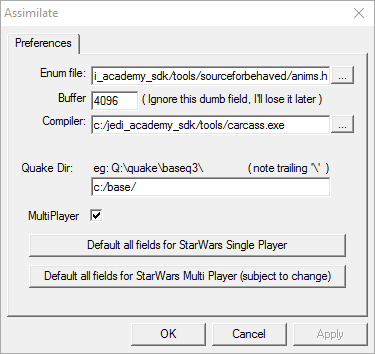
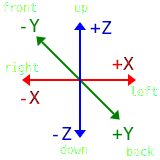
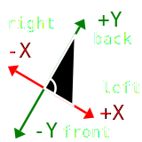
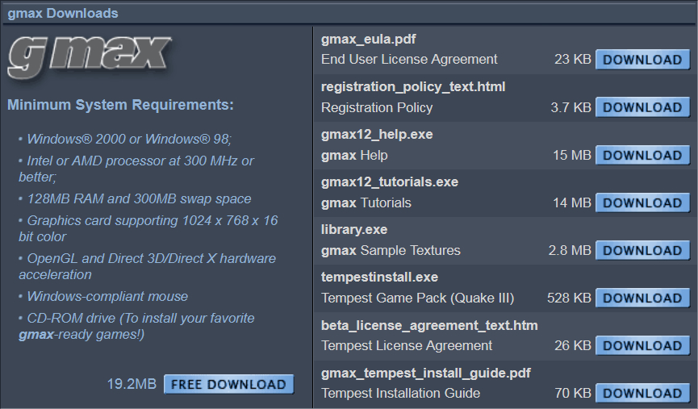
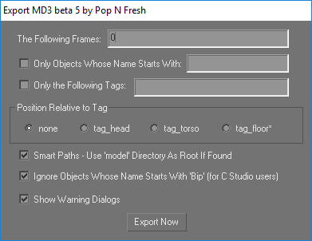

# Complete Modeling Tutorial for Jedi Knight

## Installing and Patching Jedi Knight: Jedi Academy (JKA)

Install *Jedi Academy* according to the manual. After installation apply the one and only [patch to version 1.01](http://jkhub.org/files/file/73-jedi-academy-patch-pc/). If you want you can also install the [bonus map pack](http://jkhub.org/files/file/242-jedi-academy-bonus-maps/) and the [siege destroyer map](http://jkhub.org/files/file/290-siege-destroyer-map-file/).

To create new player models, vehicles and sabers for *Jedi Knight* you need several tools. I find these helpful.

- [The multiplayer SDK](http://jkhub.org/files/file/389-jedi-academy-public-sdk/)
- [Humanoid animations package](http://jediknight3.filefront.com/file/Raven_Animation_and_Model_Source_Files_Part_1;26624)
- [Base models](http://jediknight3.filefront.com/file/Raven_Animation_and_Model_Source_Files_Part_2;26625)
- [Non-humanoid animations package](http://jediknight3.filefront.com/file/Raven_Animation_and_Model_Source_Files_Part_3;26626)
- [Models and animations package](http://jediknight3.filefront.com/file/ModelingSkinning_Guide_and_Tools;18807)
- [Siege tutorials](http://jediknight3.filefront.com/file/Siege_Map_and_Vehicle_Tutorials;23924)

Only the SDK is required. All other packages are optional. Avoid spaces in the path to all packages you install.

## Installation of Additional Tools

This guide focuses on the general work flows required to get your models into the game. Thus I assume that you know your tools for text editing, modeling, and image processing and know how to provide the required files in the correct file format. Because this is not trivial there is a section that dicusses these steps for specific tools later in this guide.

Everything in this guide can be done with [gmax 1.2](#gmax). I recommend that you also install its help files, the tutorial and the sample textures. The *Tempest Game Pack*, although originally released for *Quake III*, adds useful functionality. You definitely want to install it.

## Creating Custom Map Objects

`/devmap my_map`

## Creating Custom Sabers

### Modeling the Hilt

The triangle count of the standard hilts is on average roughly 250 (single), or 300 (dual), respectively.

Surface names have to start with *w_*.

#### Tags

- tag_blade1 aka tag_flash
- tag_blade2
- tag_blade3
- tag_blade4
- tag_blade5
- tag_blade6
- tag_blade7
- tag_blade8

The origin of the saber connects to the hand of the player. Laser is emitted along the -X axis of each tag.

A figure describes the [orientation of the tags](#tag-orientation).

### Texturing

The default saber hilt's texture size is 256 by 512 pixels.

To modify a saber hilt's texture \*.skin files are supported as well and they are similar to the [skin files for player models](#skinning).

### Exporting

Export the model as MD3 and load it into *MD3View.exe* which is part of the SDK. This is a good place to check the alignment of your model and the tags. You can view them by selecting *View* → *View Origin ( model axis and tags )*. Once you are satisfied with the result choose *File* → *Export as GLM (Ghoul 2) \*without\* 90-degree skewing ( added for JKA )*. And save the file as *base\models\weapons2\my_saber\saber_w.glm*.

# Blade Definition

Every saber requires a saber definition file which is stored in *base\ext_data\sabers*. The file format documentation is provided along with the SDK in *Tools\docs\sab_read_me.txt*. An example is given in the following.

    febrex_saber_count_dooku
    {
        name        "Count Dooku's lightsaber"
        saberType   SABER_SINGLE
        saberModel  "models/weapons2/febrex_saber_count_dooku/saber_w.glm"
        customSkin  "models/weapons2/febrex_saber_count_dooku/saber_w.skin"
        soundOn     "sound/weapons/saber/saberon.wav"
        soundLoop   "sound/weapons/saber/saberhum4.wav"
        soundOff    "sound/weapons/saber/saberoff.wav"
        numBlades   1
        saberLength 40
        saberColor red
    }

## Creating Custom Player Models

### Setting Up the Environment

Create somewhere on your hard disk the folder structure *base\models\players\\***my_model** and avoid spaces in the path. Now you need to extract the files *models\players\\_humanoid\\_humanoid.gla* and *models\players\\_humanoid\animation.cfg* from your *assets1.pk3* file which can be found in your JKA installation folder under *GameData\base*. pk3 files are zip files with a different extension. If you change the extension from \*.pk3 to \*.zip you can even open them using Windows Explorer. Extract the files to your previously created folders. You should end up with the following structure.

- base\models\players
  - _humanoid
    - _humanoid.gla
    - animation.cfg
  - my_model

### Configuring Assimilate.exe

Now you have to configure Assimilate.exe. This tool is part of the SDK as well as its companion carcass.exe. Start Assimilate.exe and open its preferences window by clicking *Edit* and then *Preferences...* where you specify the options as given in the following.

- *Enum file:* Path to the file anims.h which ships with the SDK
- *Buffer* Ignore this field
- *Compiler:* Path to the carcass.exe compiler that is part of the SDK as well
- *Quake Dir:* Path to the folder structure you created previously
- *MultiPlayer* Check it as the model is for multi player and not for single player.

### Modeling the character

Before you start modeling your favourite character you should load the skeleton for your version of the game. Now you can build the model around the skeleton and get the correct proportions right from the start.

For gmax there is a skeleton-generator in my script package for JKO and JKA.

You have to divide your model in several parts so that the game engine can deal with it later. Therefor you need to cut your model at the neck, the shoulders, the wrists, the waist and the knees. Name the resulting segments according to the following list.

- head
- torso
- hips
- l_hand
- l_arm
- r_hand
- r_arm
- l_leg
- r_leg

These are the only allowed root surfaces. You may have more but they must be child-nodes of these nine and they must be named after their parent node like head_helmet.

#### Capping the Segments

You might have noticed that it is possible to cut off individual parts of the enemies' body with the light saber. In that case it is not desirable that one can see e.g. through the shoulder into the void of the torso. Therefor you need to add so called caps between the parts of the body.

Each cap is named as *parent_name***_cap_***neighboring_object_name*. Optionally you can append _off to each cap's name which tells the engine that this geometry is not rendered by default. This trick works for other body parts as well. In total there are 16 caps.

- For head
  - head_cap_torso_off
- For torso
  - torso_cap_head_off
  - torso_cap_l_arm_off
  - torso_cap_r_arm_off
  - torso_cap_hips_off
- For hips
  - hips_cap_torso_off
  - hips_cap_l_leg_off
  - hips_cap_r_leg_off
- For l_hand
  - l_hand_cap_l_arm_off
- For l_arm
  - l_arm_cap_torso_off
  - l_arm_cap_l_hand_off
- For r_hand
  - r_hand_cap_r_arm_off
- For r_arm
  - r_arm_cap_torso_off
  - r_arm_cap_r_hand_off
- For l_leg
  - l_leg_cap_hips_off
- For r_leg
  - r_leg_cap_hips_off

#### Level Of Detail (LODs)

To increase rendering performance for distant objects and to support older hardware the game engine uses an optimization technique that reduces the number of triangles to draw by sending less complex objects to the graphics processor. To make use of this technique your model has to support different LODs. Each part of your model has to be present in each additional LOD that you support and it should be less complex than the previous one. The models created by [Raven Software](http://www.ravensoftware.com/) have four LODs in general with round about the following triangle count.

**Triangle Count Guideline per LOD**
| LOD | Triangle Count | Extension to the Part's Name |
|----:|---------------:|:-----------------------------|
| 1   | 3000           | no extension                 |
| 2   | 2000           | _1                           |
| 3   | 1000           | _2                           |
| 4   |  500           | _3                           |

That is, the part *r_hand* of the fifth LOD would be called *r_hand_4*.

#### Tag Orientation

#### Hierarchy

#### UVW Mapping

#### Weighting

A vertex is not allowed to have more than four bones weighted to it.

### Skinning

To glue some shader to each part of the model you need to write a \*.skin file that resides in the folder *my_model*. It associates each part of the model with the corresponding shader. Additionally you can turn off each part individually (i.e. it will not be visible).

At least *model_default.skin* should be present. To support team-based games like Capture The Flag (CTF) you also need *model_red.skin* and *model_blue.skin*.

    head,models/players/my_model/head
    torso,models/players/my_model/body
    hips,model/players/my_model/body
    l_arm,model/players/my_model/extremities
    l_hand,model/players/my_model/extremities
    r_arm,model/players/my_model/extremities
    r_hand,model/players/my_model/extremities
    l_leg,model/players/my_model/extremities
    r_leg,model/players/my_model/extremities
    head_cap_torso_off,model/players/my_model/caps
    torso_cap_head_off,model/players/my_model/caps
    torso_cap_l_arm_off,model/players/my_model/caps
    torso_cap_r_arm_off,model/players/my_model/caps
    torso_cap_hips_off,model/players/my_model/caps
    l_arm_cap_torso_off,model/players/my_model/caps
    l_arm_cap_l_hand_off,model/players/my_model/caps
    r_arm_cap_torso_off,model/players/my_model/caps
    r_arm_cap_r_hand_off,model/players/my_model/caps
    l_hand_cap_l_arm_off,model/players/my_model/caps
    r_hand_cap_r_arm_off,model/players/my_model/caps
    hips_cap_torso_off,model/players/my_model/caps
    hips_cap_l_leg_off,model/players/my_model/caps
    hips_cap_r_leg_off,model/players/my_model/caps
    l_leg_cap_hips_off,model/players/my_model/caps
    r_leg_cap_hips_off,model/players/my_model/caps

To disable geometry put `\*off` instead of the shader behind the comma, e.g., `head_helmet,\*off`. This is especially useful if you want to create custom skins without modifying the geometry itself.

`//` and `/**/` style comments are allowed in skin files.

### Icon

Each skin file should be accompanied by a corresponding icon such that the player can select the model in the game's menus. If the \*.skin is named model_xyz.skin, then the icon is named icon_xyz.jpg. The default icons are icon_default.jpg, icon_red.jpg, icon_blue.jpg. They are 128 by 128 pixels.

### References

- [Guide to getting a model in to JediKnight 2](http://psyko3d.50webs.com/tutorials/spacemonkey/jk2.htm) by spacemonkey
- Player Modelling-Tutorial by Charmin Deluxe
- [The Complete Guide to JK2/JK3 Character Compiling](http://psyko3d.50webs.com/tutorials/jk2_guide.htm) by Psyk0
- [Addendum to SpaceMonkey’s 3dsmax to JK2 modeling tut](https://gamefront.online/files/606863/addendum.zip) by MacD
- Model Construction Conventions Jedi Knight II Jedi Outcast by Michael Gummelt

## Creating Custom Vehicles

### References

- [Vehicle Importing Tutorial for JA](https://jkhub.org/tutorials/modeling/duncans-vehicle-tutorial-r177/) by Duncan_10158

## Creating Custom Weapons

### World and Hand Model

## gmax

### Downloading and Activation

Unfortunately, downloading gmax from TurboSquid is no longer possible. But you can get everything here instead.

- [gmax12.exe](../../releases/download/gmax/gmax12.exe)
- [gmax_eula.pdf](../../releases/download/gmax/gmax_eula.pdf)
- [registration_policy_text.html](../../releases/download/gmax/registration_policy_text.html)
- [gmax12_help.exe](../../releases/download/gmax/gmax12_help.exe)
- [gmax12_tutorials.exe](../../releases/download/gmax/gmax12_tutorials.exe)
- [library.exe](../../releases/download/gmax/library.exe)
- [tempestinstall.exe](../../releases/download/gmax/tempestinstall.exe)
- [beta_license_agreement_text.htm](../../releases/download/gmax/beta_license_agreement_text.htm)
- [gmax_tempest_install_guide.pdf](../../releases/download/gmax/gmax_tempest_install_guide.pdf)

gmax requires a registration code that one could get in the old days from TurboSquid as well. Try this one: `406D3EEAE53C503A45943BE247DD1C2366423C47B914C359`

### Export Quake III (\*.MD3)

The *Tempest* gamepack ships with the MD3 exporter *md3exp.dle* thats installed in *gmax\gamepacks\Tempest\plugins*. Copy it to *gmax\plugins* such that gmax automatically loads it during start up.

Selecting *File* → *Export ...* and choosing a file name opens the *Export MD3 beta 5 by Pop N Fresh* dialog.

- *The Following Frames:* Choose frames to export. For non-animated models entering 0 is sufficient. To select ranges of frames comma (,) and hyphen (-) are supported.
- *Only Objects Whose Name Starts With:* Filter exported objects by name prefix
- *Only the Following Tags* Separate multiple tags by comma (,)
- *Position Relative to Tag* In general not needed to export to Jedi Academy
- *Smart Paths - Use 'model' Directory As Root If Found* Useful but most of the time you will work with *.skin files anyway
- *Ignore Objects Whose Name Starts With 'Bip' (for C Studio users)* Select this option
- *Show Warning Dialogs* Select this option
