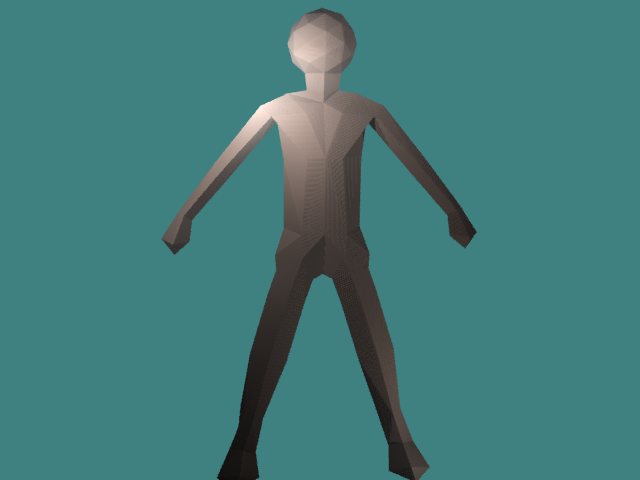
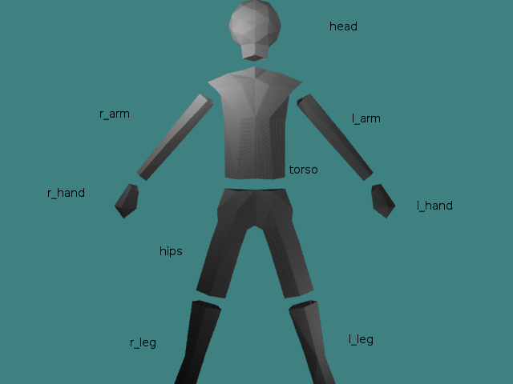
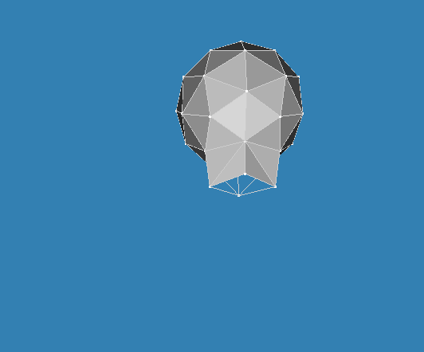
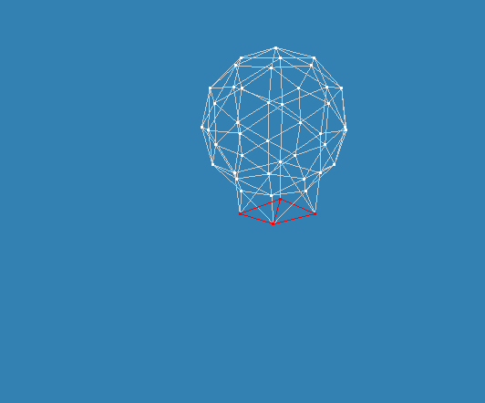
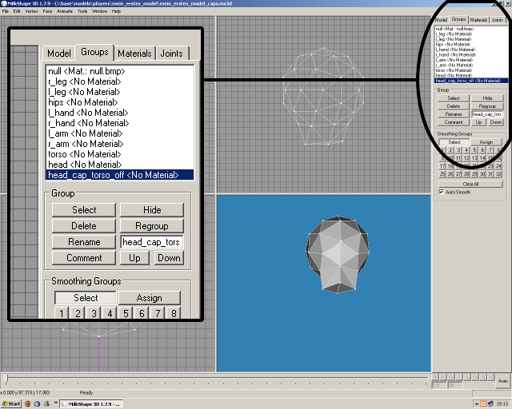
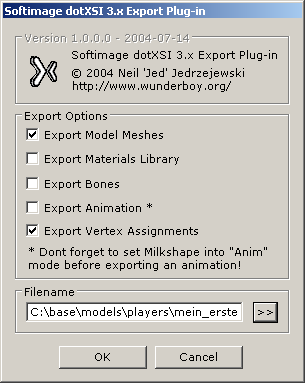

# Modeling a Character

## Goal

As you have set everything up in the first tutorial, you will now create a character. The 3D program Milkshape 3D is used for this. You will also prepare the model for export to XSI format.

## Prerequisites

- [Milkshape 3D](http://www.milkshape3d.com/) (MS3D)
- [MS3D model skeleton]() or an arbitrary Jedi Knight model

## Steps

1. [Modeling a Character](#modeling-a-character)
2. [Dividing the Model](#dividing-the-model)
3. [Cap the Model](#cap-the-model)
4. [Exporting](#exporting)

### Modeling a Character

We start in Milkshape 3D - if you don't have this, it's no problem, because almost any other free modeling program is fine - and load the JK Model Skeleton for Milkshape 3D. This only serves as an aid so that we can align the body correctly when modeling. Alternatively, you can use Milkshape's \*.glm importer to import a Jedi Knight model and see how the body parts are aligned there.

I have created an example model for this introduction:

Save your model in *C:\base\models\players\my_first_model* as *my_first_model_without_parts.ms3d*.

### Dividing the Model

The model still consists of a single piece. But we will change that now. The Quake 3 engine version of the JK series expects a model to consist of 9 basic parts:

- head
- torso
- hips
- l_hand
- l_arm
- r_hand
- r_arm
- l_leg
- r_leg

The picture illustrates where the cutting points are. I have pulled the parts apart to make it clearer. In your case, of course, they stay together.

To subdivide, we proceed as follows in Milkshape: In the tab menu on the right-hand side, choose *Model* -> *Select* -> *Face*. Now select the part you want to separate and click on *Regroup* under the *Groups* tab. In the same area you can also rename the new part. Enter the appropriate name and click on *Rename*.

Once you have finished all 9 parts, save the file under *C:\base\models\players\my_first_model* as *my_first_model_parts.ms3d*.

### Cap the Model

Jedi Knight has the special feature that you can cut off the (nine) body parts of the models. To prevent the player from looking through the shoulder into the upper body, for example, we have to install so-called caps. Caps close the end of one body part to the other. Caps are named like this:
*\<name_of_parent_object\>_cap_\<name_of_adjacent_object\>*
However, we add *_off* to the end of the name. All model parts that end with this part are not displayed by the engine by default. There are 16 caps in total:

- The head includes:
  - head_cap_torso_off
- The torso includes:
  - torso_cap_head_off
  - torso_cap_l_arm_off
  - torso_cap_r_arm_off
  - torso_cap_hips_off
- The hips include:
  - hips_cap_torso_off
  - hips_cap_l_leg_off
  - hips_cap_r_leg_off
- The l_hand includes:
  - l_hand_cap_l_arm_off
- Belongs to the l_arm:
  - l_arm_cap_l_hand_off
  - l_arm_cap_torso_off
- Belongs to the r_hand:
  - r_hand_cap_r_arm_off
- Belongs to the r_arm:
  - r_arm_cap_r_hand_off
  - r_arm_cap_torso_off
- Belongs to the l_leg:
  - l_leg_cap_hips_off
- The r_leg includes:
  - r_leg_cap_hips_off

The easiest way to add caps is to hide everything in the scene and only keep the part for which you want to make the caps visible. In Milkshape, you can hide objects by selecting them under the *Group* tab and then clicking on *Hide*. To make them visible again, select them again and click *Hide* again.
I'll show you how to do this using the head as an example.

All model parts except the head are hidden, you can clearly see the hole in the neck. Now I model the hole with the existing vertices.

As you can see, the hole is closed. Now I select the polygons that close the hole and create a new group from them (technique: see above). Then I rename it to head_cap_torso_off.

Proceed in this way until all caps have been created. Then save the model - as usual in *C:\base\models\players\my_first_model* - as *my_first_model_caps.ms3d*.

### Exporting

Now we can export the model to XSI format. But don't forget to delete everything else from the file - like the model skeleton - first. To export, click on *File* -> *Export* -> *Softimage dotXSI 3.x* in Milkshape. A window will open to set the parameters for the export.

You are doing quite well with my settings, so you can use them. Select *C:\base\models\players\my_first_model\my_first_model_export.xsi* as the file name. Click *OK* to start the export process. A window will show you when the export has been successfully completed.

Congratulations! You have finished splitting and exporting your model!
