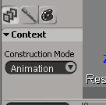
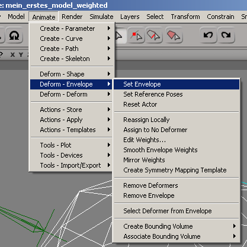
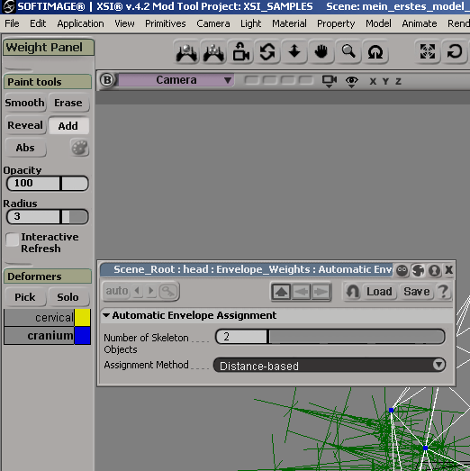
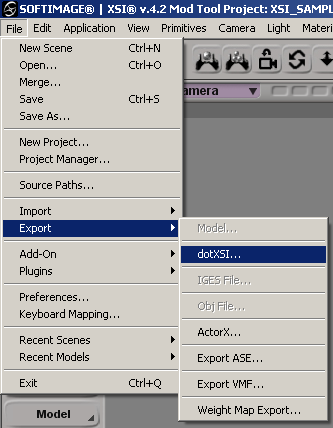
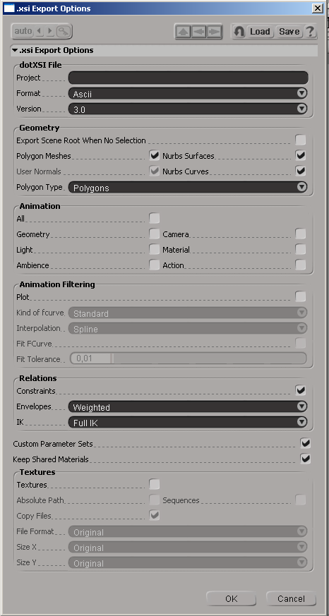
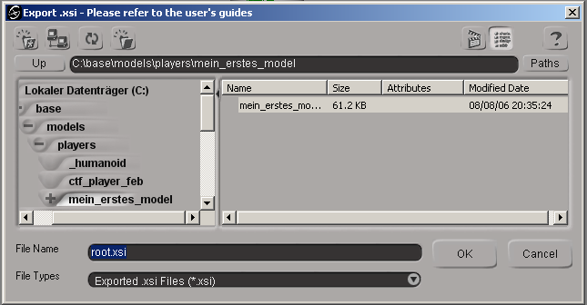

# Enveloping: Connect Model and Skeleton

## Goal

## Prerequisites

## Steps

1. [Set Up UI](#set-up-ui)
2. [Animation Mode](#animation-mode)
3. [Enveloping](#enveloping)
4. [Exporting](#exporting)

### Set Up UI

Load your model into XSI. If you have done the tutorial up to this point, this should be *my_first_model_hierarchy.exp*. In other words, a model that has a fully constructed hierarchy. Enlarge the perspective view to the full window size by left-clicking on the image of the nested squares at the top right of the 3D view. You will recognize this symbol from chapter 3.

Now you need to display the model in the wireframe view. You can do this by clicking on the button to the left of the one above - which now probably shows *Shaded*. In the drop-down menu that opens, you can then click on *Wireframe*. Now save the model as *my_first_model_weighted.exp*.

### Animation Mode

To complete the following steps, you must switch XSI to animation mode. You will find a field called *Construction Mode* in the bottom left-hand corner of XSI. Simply click on the down arrow and select *Animation*.

Now press *Ctrl+3* to open the *Weight Panel*. Of course, you can easily and extremely precisely weight the most complicated objects with this panel, but I will limit myself to the simple way here.

### Enveloping

In the 3D view, select the object you want to weight. Let's start with the head. It is best to zoom in so that the head fills most of the visible area. With the head selected, click on *Animate* -> *Deform - Envelope* -> *Set Envelope* in the menu bar at the top.

The mouse pointer should now have changed and display PICK below it. Click on the two bones that belong to the head. When you have finished, click in the free space on the right. This will end the mode in which you add new bones to the object. If possible, try not to click on model parts when clicking. Otherwise they will become bones for this object and carcass.exe will complain that it has found a bone that does not exist.

Right-click to open a window that you can safely close. It is used to adjust the automatic weighting. However, as our model is not very complex, readjustment is relatively pointless. At the same time, you can see in the weight panel that the bones selected by right-clicking are listed here. However, this point is only important for more complex structures.

Repeat this step with the other model parts (the 9 base parts and the 16 caps). You do not need to weight the bolts, they are already weighted. For weighting, always use the bones that are inside or partially inside the object you are working on. You can simply select the caps via the explorer (button *8*).

Once you are finished with everything, you can save the model as *my_first_model_weighted2.exp*. This way you always have the option of reverting to a non-weighted version in the event of serious errors.

### Exporting

**First of all, a request:** Don't despair if you have to repeat steps 3 and 4 again. Mistakes always happen when weightening. It may also be that you want to have exactly one vertex controlled by another bone. Even then you will have to return here.

OK, let's continue. Via *File* -> *Export* -> *dotXSI...* you reach the export menu.

A few settings need to be made here. The animations - just like the textures - are not exported. Simply accept my settings and then click on *OK*.

Here you can now select the storage location for the model. This is of course *C:\base\models\players\my_first_model*. The file name must be *root.xsi*.

Click *OK* to complete the export process. However, XSI still needs quite a while to complete the process internally. So do not force XSI to close.

Congratulations! You are now very close to your goal!