# Create UVW Maps

## Goal

In this part of the tutorial you will import your model into the XSI|Mod tool and then create a UVW map to be able to paint the textures later.

## Prerequisites

- [XSI Mod Tool](https://www.moddb.com/downloads/autodesk-softimage-mod-tool-75)

## Steps

1. [Importing the model](#importing-the-model)
2. [The XSI user interface](#the-xsi-user-interface)
3. [UVW Mapping](#uvw-mapping)
4. [Rendering UVW Maps](#rendering-uvw-maps)

### Importing the Model

Start the XSI|Mod Tool. The user interface takes some getting used to, especially if you have worked with Gmax before. For this introduction I will try to explain everything as good as possible. When you start XSI, a window called *Netview* opens within the program. You can safely close this window. Via *File* -> *Import* -> *dotXSI...* you get to the import dialog for \*.xsi files.

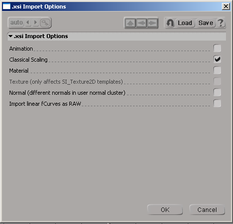

The only option you leave selected in this dialog is - as shown in the picture - *Classical Scaling*. Clicking on *OK* takes you to the next section.

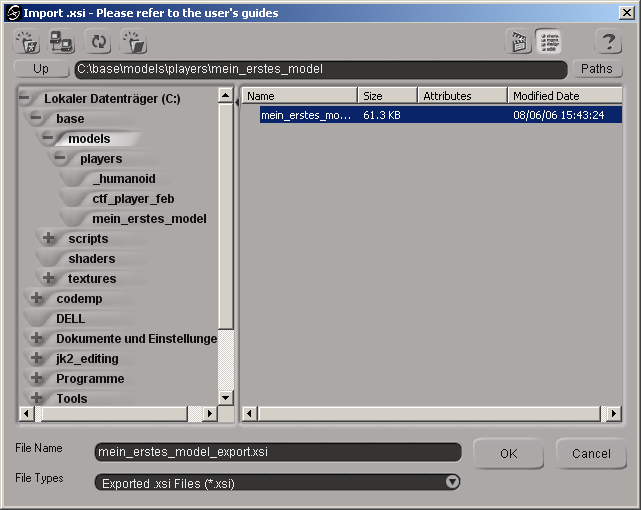

Select the file (*my_first_model_export.xsi*) that we created in the last tutorial and click *OK* again. A loading bar shows you the progress of the import.

### The XSI User Interface

Now we have imported the model and can familiarize ourselves a little with the interface. Zooming, rotating and moving the view is very simple. If the mouse pointer is over one of the view windows, all you have to do is press *S* on the keyboard and you can perform the actions with the three mouse buttons (left, right, wheel button). Press *S* again to exit this mode. Try to see your model completely from the front in the perspective view. At the moment we can only see our model in wireframe mode.

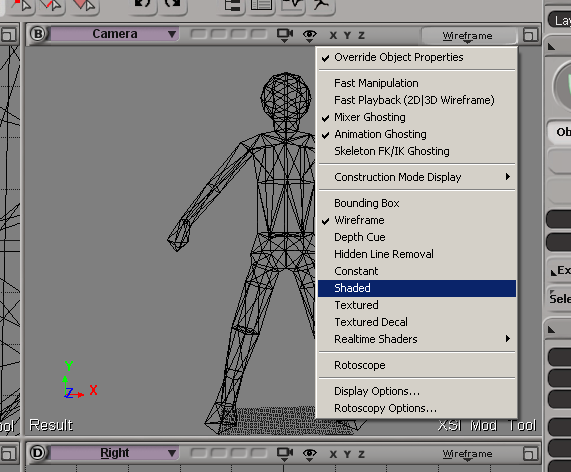

Switch to shaded mode in the perspective view. To do this, click on the button labeled *Wireframe* and select *Shaded* from the drop-down menu. Now you can switch between the two modes at any time by clicking on *Wireframe* or *Shaded* with the wheel button.

Another important step is to switch on the *Head Light*. This is a light source that follows the camera and therefore noticeably improves your work.

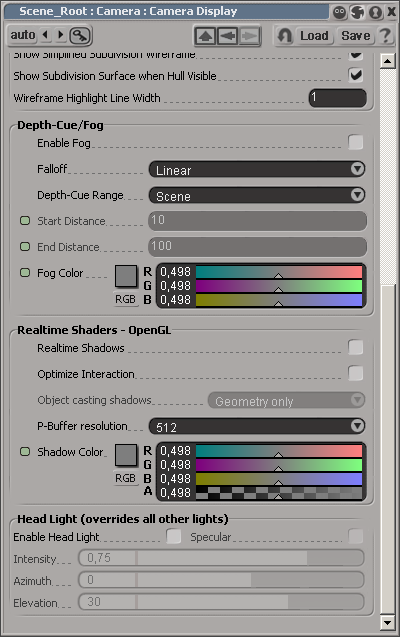

In the same menu as before, select the entry *Display Options...* a little further down. In the window that now opens, scroll all the way down and check the box next to *Enable Head Light*. It is now activated and you can close the window.

### UVW Mapping

Now it's time to get down to business. We will give the model a layout texture and then UVW map it. To do this, we need to load the render interface in XSI. Pressing the *3* key is enough to do this. The menu headings turn a grayish blue and *Render* appears at the top left. Now we select the torso by simply left-clicking in the perspective view. Then click on *Texture* -> *Image* in the menu on the left as shown in the picture.

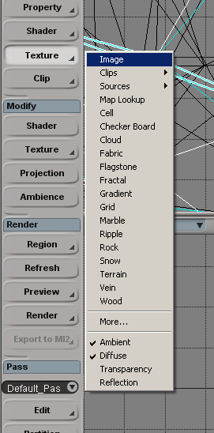

As is the case in life, nothing runs smoothly. We confirm the message that appears with *Yes*.

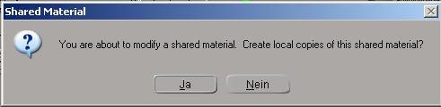

And yet another new window opens. Here you can define the texture and its projection. We keep the setting for the texture, because we want to have a layout texture. But we change the projection or, because there is none, we set it again.

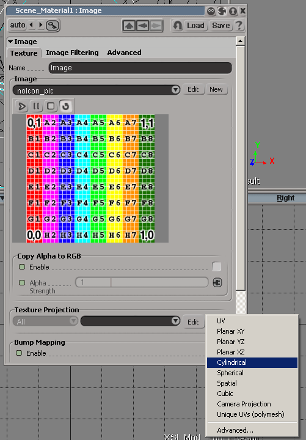

In the *Texture Projection* section, click on *New* -> *Cylindrical*. In the *Perspective* view, switch to the *Textured* display mode. This works in the same way as described in step 2 for the shaded mode. In *Textured* mode, we can now see the torso beautifully textured, almost without distortion. "Good", you will say to yourself now, "the torso is not yet a complex model. I could have done that with LithUnwrap."

To show you the really good XSI unwrapping tools, let's take a look at the hips. Proceed with it in the same way as with the torso. If we rotate the model now, we will see ugly distortions on the back, which we will now remove. The first step is to set up the model again.

It is best to save the model once. *File* -> *Save*. I simply saved it in the standard folder for XSI scenes as *my_first_model_uvw.exp*.

Now click on the symbol of two nested squares at the top right above the perspective view using the mouse wheel button. This is what the symbol looks like:

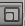

The view should now occupy the entire width horizontally. Next, we open the *Texture Editor*. All you need to do is press *Alt+7*. The lower half is now occupied by the *Texture Editor*. If not, you must move it to the bottom.

In the perspective view, where we still have the hips selected, we now press *U*, which takes us to the polygon selection mode. Now select all the polygons of one of the two legs. In the picture you can see how it looks in my case.

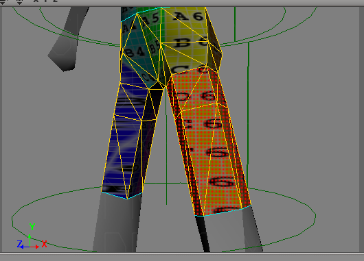

In the *Texture Editor*, first click on *View* -> *Dim Image*. This darkens the image and makes your work easier. Now click on the small yellow cylinder and then on *Best Fit*.

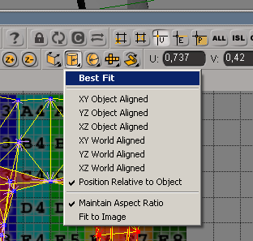

This ensures that the leg is UVW-mapped in the best possible way and scaled to the size of the layout texture. But we can still see - as in the picture - an unfortunate kink that will certainly interfere when painting the textures. This still needs to be removed. First, move the polygons of the leg a little to the right so that you can see them better. You do this with the *s*, *r* and *t* buttons of the *Texture Editor*. You can also darken the texture with the three-colored button above.

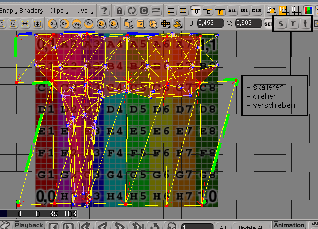

Now select the two overhanging polygons in the 3D view and move them to where they belong in the *Texture Editor*. Practical coloring always tells you which polygon edges belong together. You can deselect the polygons that are still selected in the *Texture Editor* by clicking on an empty area, but then you have to reactivate the polygon selection tool. Or you can click on the polygons in the 3D view with the right mouse button.

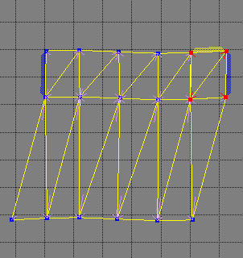

Now you have to merge the vertices with each other so that the UVW map has no gaps. Deselect all vertices with the key combination *Ctrl+Shift+A*. Now select the two vertices that belong together in the *Texture Editor*.

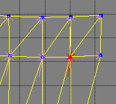

Then press the \* key on your Num Pad. The vertices are merged.

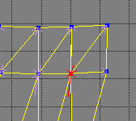

When you have finished with the other vertices, move the leg back onto the layout texture. This way you can UVW map the entire model perfectly. Don't forget the caps. It will be difficult to select them in the 3D view. Just press *8* on the keyboard and a schematic view of the scene will open. Here you can also select the caps.

### Rendering UVW Maps

Textures can be rendered in XSI by going to *Edit* -> *Stamp UV Mesh* in the *Texture Editor* and saving the texture.

Congratulations! You now have your model nicely UVW-mapped!