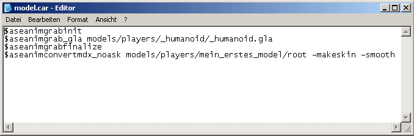
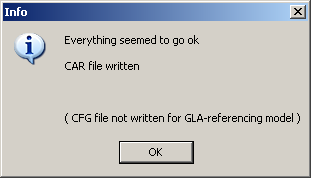
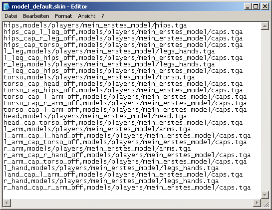
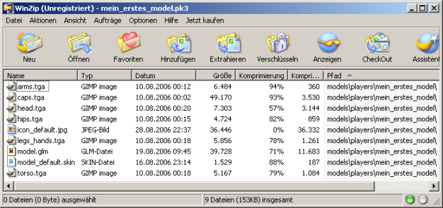
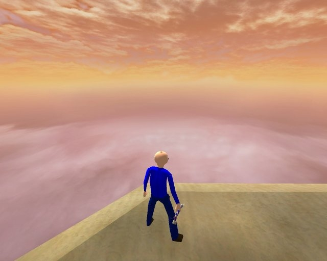

# Bringing the finished model into the game

## Goal

Now we will assimilate the model here, write a \*.skin file and wrap everything in a \*.pk3 to bring it into play.

## Prerequisites

- Assimilate.exe, as configured in [the first chapter](work-environment-setup.md)
- A file archiver like [7-Zip](http://www.7-zip.org/)
- A text editor like Notepad

## Steps

1. [Create car File](#create-car-file)
2. [Assimilate](#assimilate)
3. [Create skin File](#create-skin-file)
4. [Create pk3 File](#create-pk3-file)

### Create car File

We will now write a \*.car file. This is a configuration file for carcass.exe. Write the following content in a new text file:

    $aseanimgrabinit
    $aseanimgrab_gla models/players/_humanoid/_humanoid.gla
    $aseanimgrabfinalize
    $aseanimconvertmdx_noask models/players/my_first_model/root -makeskin -smooth

Save this file under *C:\base\models\players\my_first_model* as *model.car*.

### Assimilate

Now start *Assimilate.exe*. We have already set this up completely in the first tutorial. Click on *File* -> *Open...*. A window opens in which you select and open the model.car file you have just created. Now you can click on the button with the B. A DOS window opens and closes if everything went well. You will also receive this window if everything went well.

In the event of failure, the DOS window will inform you of the error. At this point, however, we assume success. You can now close *Assimilate.exe*.

If you receive an error message, you can search on your favorite search engine. However, many error messages are already explained in the [LucasForums](http://www.lucasforums.com/). Another help is the [Carcass Error Guide By Bell](http://psyko3d.50webs.com/tutorials/errorfaq.htm).

### Create skin File

Since for some reason the parameter export does not work, you must now write a \*.skin file by hand. *Assimilate.exe* has already created one (*model_default.skin*), but it is empty. Each model must have at least one \*.skin file, otherwise it cannot be played with. For team-based game modes such as Capture The Flag (CTF) or Team Free-For-All (TFFA), 2 additional \*.skin files are required.

- *model_default.skin* for the "normal" game
- *model_red.skin* for the red team
- *model_blue.skin* for the blue team

You can also create as many additional \*.skin files as you like.

Go to the folder of your model (*C:\base\models\players\my_first_model*) and open the file *model_default.skin* with a text editor.

The syntax of a *.kin file is: `<name of the object>,<path to the texture>`. Each object of the model must be listed here. It looks like this for our model:

And because copying is boring, here is the complete content to copy out again.

    hips,models/players/my_first_model/hips.tga
    hips_cap_l_leg_off,models/players/my_first_model/caps.tga
    hips_cap_r_leg_off,models/players/my_first_model/caps.tga
    hips_cap_torso_off,models/players/my_first_model/caps.tga
    l_leg,models/players/my_first_model/legs_hands.tga
    l_leg_cap_hips_off,models/players/my_first_model/caps.tga
    r_leg,models/players/my_first_model/legs_hands.tga
    r_leg_cap_hips_off,models/players/my_first_model/caps.tga
    torso,models/players/my_first_model/torso.tga
    torso_cap_head_off,models/players/my_first_model/caps.tga
    torso_cap_hips_off,models/players/my_first_model/caps.tga
    torso_cap_l_arm_off,models/players/my_first_model/caps.tga
    torso_cap_r_arm_off,models/players/my_first_model/caps.tga
    torso_cap_l_arm_off,models/players/my_first_model/caps.tga
    head,models/players/my_first_model/head.tga
    head_cap_torso_off,models/players/my_first_model/caps.tga
    l_arm,models/players/my_first_model/arms.tga
    l_arm_cap_l_hand_off,models/players/my_first_model/caps.tga
    l_arm_cap_torso_off,models/players/my_first_model/caps.tga
    r_arm,models/players/my_first_model/arms.tga
    r_arm_cap_r_hand_off,models/players/my_first_model/caps.tga
    r_arm_cap_torso_off,models/players/my_first_model/caps.tga
    l_hand,models/players/my_first_model/legs_hands.tga
    land_cap_l_arm_off,models/players/my_first_model/caps.tga
    r_hand,models/players/my_first_model/legs_hands.tga
    r_hand_cap_r_arm_off,models/players/my_first_model/caps.tga

Save the file. If you want, you can now load your model into *ModView* and see if everything works by playing the animations. In addition to the \*.skin file, you need a 256x256 pixel image in \*.jpg format. It must be named like the \*.skin file to which it should belong. This image is used to select the model in the game via the menu. If the \*.skin file is called *model_**default**.skin*, the \*.jpg file is called *icon_**default**.jpg*.

### Create pk3 File

Now you have to pack everything into a \*.pk3 file. This has the following structure:

- models
  - players
    - my_first_model
      - model.glm
      - model_default.skin
      - icon_default.jpg
      - model_red.skin
      - model_red.jpg
      - model_blue.skin
      - model_blue.jpg
      - arms.tga
      - caps.tga
      - head.tga
      - hips.tga
      - legs_hands.tga
      - torso.tga

Nothing more is necessary. If you also want to make your model available as an Non-Player Character (NPC), you will need to write a few other files, but these are not covered in this tutorial. You can now place the \*.pk3 file in the base folder of your Jedi Knight installation and play your model in the game.

Congratulations! You made it to the end and can create your own player models in the future!
