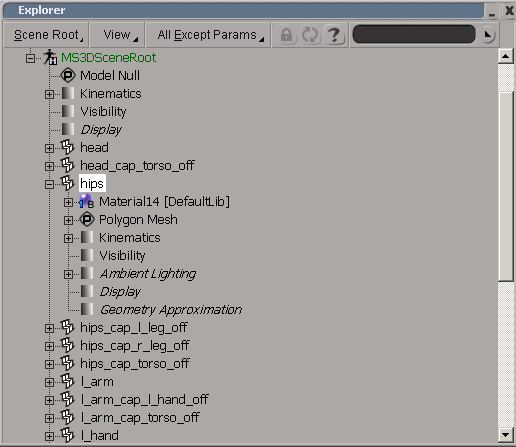
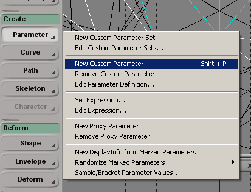
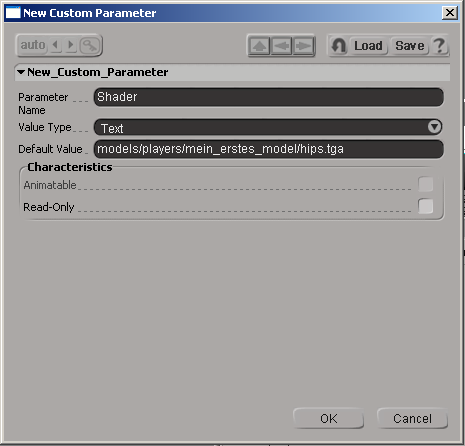

# Painting a Skin

## Goals

The UVW mapping is over. We will now paint the textures and have the writing of a *.skin file done for us.

## Prerequisites

- [XSI Mod Tool](https://www.moddb.com/downloads/autodesk-softimage-mod-tool-75)
- An image editor like [GIMP](https://www.gimp.org/)

## Steps

1. [Painting the Texture](#painting-the-texture)
2. [Set Custom Parameters](#set-custom-parameters)

### Painting the Texture

With the help of the UVW maps you can paint the textures with a graphics program. You just have to follow a few rules:

- The side lengths of the textures must be a power of 2 (e.g. 16, 32, 64, 128 etc.).
- The texture does not have to be square; 128*512 is allowed.
- The texture must be saved in \*.tga or \*.jpg format.
- Save your finished textures in the folder *C:\base\models\players\my_first_model*.

### Set Custom Parameters

**Preliminary remark:** For some reason, this part does not work with the Mod Tool. Although the version restrictions state that you can save your own parameters, this does not seem to apply to exporting, as the parameters do not appear in the exported file. So we have to write a *.skin file in the conventional way. So you can skip the rest of this introduction. If I find out anything else, I will update this here.

Raven Software used a feature of XSI in the development of Jedi Knight to take the hassle out of writing \*.skin files. Simply start XSI and open your model. Now press the *2* key on your keyboard to switch to the animation interface. You must also press *8* to call up a schematic view of your model. In this menu, open the tree under MS3DSceneRoot. You will now see the complete list of all model parts that belong to our player model. Simply click on hips. It will be highlighted in white and selected in the 3D view. Now click on the *+* sign in front of hips. Another branch with the properties of this object opens.

Now we will add a custom property. In the animation menu on the left, click on *Parameter* -> *New Custom Parameter* under *Create*.

In the window that opens, we now enter - who would have thought? - a few values. *Parameter Name* is always *Shader*. Likewise, *Value Type* is always *Text*. You can then enter the path to the texture that belongs to the selected object in *Default Value*. When assimilating, this value is then used to write the \*.skin file.

Then click on *OK*. A new parameter with the name *CustomPSet* is now displayed in the Explorer window under hips with the image in front of it representing a *c*. Right-click on CustomPSet and select *Rename* from the drop-down menu. Give the parameter the name *Game*. Save the model. Repeat this step for all other model parts until they all have the *Game* parameter with the correct value.

Congratulations! You have also finished this tutorial!