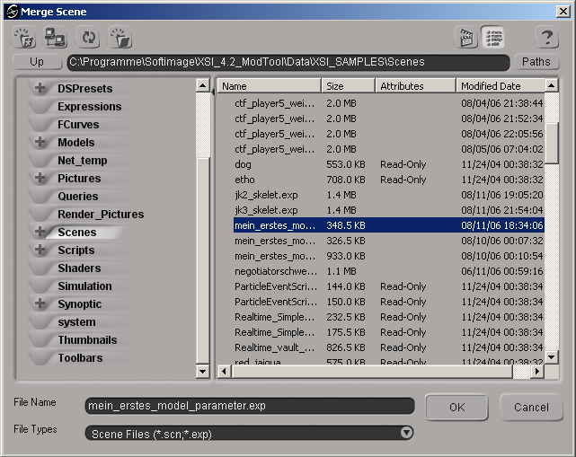
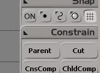
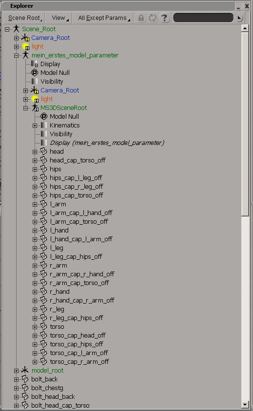
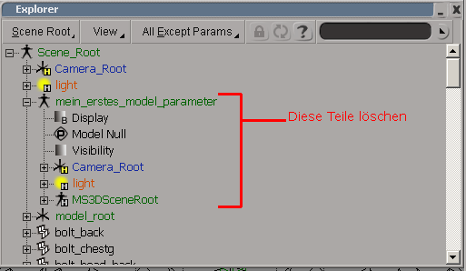

# Set Up a Hierarchy

## Goal

We are rapidly approaching the completion of this tutorial series. In this part, we will place our model with the Jedi Knight skeleton in a scene and create the hierarchy.

## Prerequisites

- [XSI Mod Tool](https://www.moddb.com/downloads/autodesk-softimage-mod-tool-75)

## Steps

1. [Merging Model and Skeleton](#merging-model-and-skeleton)
2. [Model Hierarchy](#model-hierarchy)
3. [Saving](#saving)

### Mergin Model and Skeleton

You have already downloaded and unpacked the model skeleton in the first tutorial. Now start XSI and load the model skeleton (*File* -> *Open...*). Now you have to insert your model into this scene by clicking on *File* -> *Merge...*. Select your model in the opened dialog and click on *OK*.

If your model is not congruent with the skeleton, you may need to rotate, scale or move it. To do this, use the tools in XSI, which are marked on the right-hand side with the letters *s*, *r* and *t* (from top to bottom). Now save the model as *my_first_model_hierarchy.exp*.

### Model Hierarchy

Now open the Explorer (key *8* on the keyboard). If you want, you can also open a tree view (key *9*), which shows you the hierarchy of the model. However, we do not need this. Especially as it is far too small and you cannot change the hierarchy using it. You only need 2 buttons to change this.

- *Parent* is used to define a new parent-child relationship.
- *Cut* deletes such a relationship again.

In Explorer, you should find a tree that starts with the file name of your model. In my case, this is my_first_model_parameter. Open this tree until you can see the 16 basic parts of the model.

Select all 16 in this window and then click *Cut* twice. The 16 parts are now only children of *Scene_Root*. This is exactly what we wanted to achieve. Now you have to delete both remaining parts of the model file. In my case, these are *MS3DSceneRoot* and *my_first_model_parameter*. You also have to delete light and *Camera_Root*.

**Important:** You can only delete parts that no longer have children.

To realize a parent-child relationship, you have to go the following way in the Explorer:

1. Select the child or children.
2. Click on the Parent button.
3. Click on the parent object with the middle mouse button.
4. Right-click in free space in the Explorer to exit the mode again

Use this method as follows:

The children of *l_leg* are:

- bolt_l_leg_calf
- bolt_l_leg_cap_hips
- bolt_l_leg_foot
- bolt_l_leg_knee
- l_leg_cap_hips_off

The children of *r_leg* are:

- bolt_r_leg_calf
- bolt_r_leg_cap_hips
- bolt_r_leg_foot
- bolt_r_leg_knee
- r_leg_cap_hips_off

The children of *l_hand* are:

- bolt_l_hand
- bolt_l_hand_cap_l_arm
- l_hand_cap_l_arm_off

The children of *r_hand* are:

- bolt_r_hand
- bolt_r_hand_cap_r_arm
- r_hand_cap_r_arm_off

The children of *head* are:

- bolt_head_back
- bolt_head_cap_torso
- bolt_head_eyes
- bolt_head_front
- bolt_head_left
- bolt_head_right
- bolt_head_top
- head_cap_torso_off

The children of *l_arm* are:

- bolt_l_arm_cap_l_hand
- bolt_l_arm_cap_torso
- bolt_l_arm_elbow
- l_arm_cap_l_hand_off
- l_arm_cap_torso_off
- l_hand

The children of *r_arm* are:

- bolt_r_arm_cap_r_hand
- bolt_r_arm_cap_torso
- bolt_r_arm_elbow
- r_arm_cap_r_hand_off
- r_arm_cap_torso_off
- r_hand

The children of *torso* are

- bolt_back
- bolt_chestg
- bolt_hip_bl
- bolt_hip_br
- bolt_hip_fl
- bolt_hip_fr
- bolt_hip_l
- bolt_hip_r
- bolt_lchest_l
- bolt_lchest_r
- bolt_shldr_l
- bolt_shldr_r
- bolt_torso_cap_head
- bolt_torso_cap_hips
- bolt_torso_cap_l_arm
- bolt_torso_cap_r_arm
- bolt_uches

### Saving

Save your model as *my_first_model_hierarchy.exp* and admire it, because you have also completed this tutorial! Congratulations!