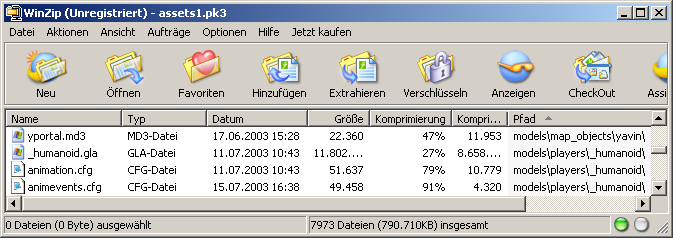
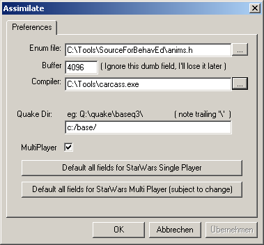

# Set Up Working Environment for Player Modeling

## Goal

In this tutorial you will learn which files and programs you need to create a new player model for JK2 or JKA and how to set them up.

## Prerequisites

- [XSI Mod Tool](https://www.moddb.com/downloads/autodesk-softimage-mod-tool-75)
- A file archiver like [7-Zip](http://www.7-zip.org/)
- ModView.exe, carcass.exe, Assimilate.exe; all included in the Software Development Kit (SDK)

## Steps

1. [Create Folder Structure](#create-folder-structure)
2. [Set Up Assimilate.exe, carcass.exe, ModView.exe](#set-up-assimilate-carcass-modview)
3. [Download XSI Mod Tool](#download-xsi-mod-tool)

### Create Folder Structure

First of all, you need to create a good development environment and set up a few things. Create the folder *base* in *C:\* and in it the folder *models* and in this the folder *players*. You can create as many folders as you like in the *players* folder - one for each of your models. In this tutorial, we will create a folder called *my_first_model* in *C:\base\models\players*. In the rest of this tutorial, I will always refer to the paths that we set up here. So if you choose other names at this point, you will always have to rethink. Now go to your Jedi Knight installation (default path: *C:\Program Files\LucasArts\Star Wars Jedi Knight Jedi Academy\GameData\base*) and open the *assets1.pk3* file with an archiver. Unzip the files *_humanoid.gla* and *animation.cfg* to *C:\base*. Caution: There is more than one *animation.cfg* in this pk3! This is the one in the subfolder *models\players\\_humanoid*. The picture may clarify this again:

You also extract the archive with the model skeleton to *C:\base*. You should now have the following folder structure:

- C:\base\models\players\
  - _humanoid
    - _humanoid.gla
    - animations.cfg
  - jka_skelett
    - jka_skelett.exp
  - my_first_model

### Set Up Assimilate, Carcass, ModView

Next, we need the 3 files *ModView.exe*, *carcass.exe*, *Assimilate.exe*. In my case, these are located in *C:\Tools*, because *carcass.exe* in particular does not like spaces and special characters in the path. Start *Assimilate.exe*. Under *Edit* -> *Preferences...* you will find the dialog in the picture:

- *Enum file:* The path to the anims.h file included with the SDK must be specified here.
- *Buffer* Here we follow the instructions of the Assimilate developer
- *Compiler:* The path to carcass.exe must be entered here.
- *Quake Dir:* Enter the path to the base folder that we set up previously.
- *MultiPlayer* Decides whether the model is for multiplayer or single player. We set the check mark.

Now you can click on *OK* and close Assimilate.

### Download XSI Mod Tool

XSI Mod Tool cannot be downloaded from the official website anymore, but you can still download it from [ModDB](https://www.moddb.com/downloads/autodesk-softimage-mod-tool-75)
