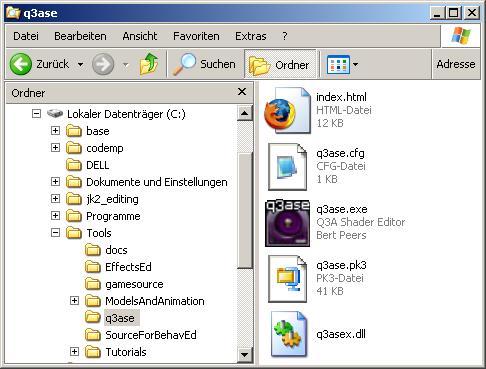
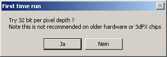
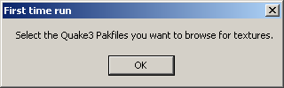
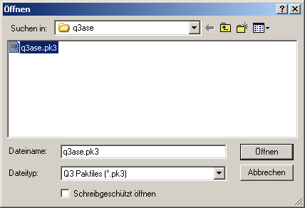
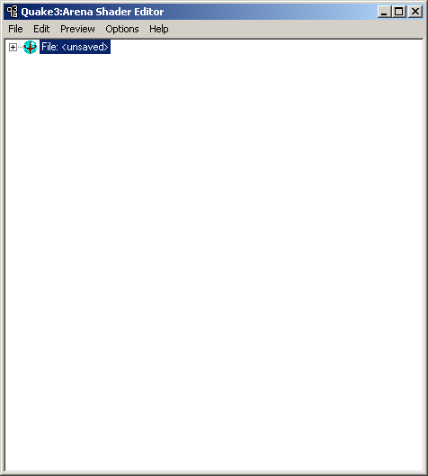
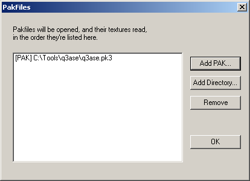
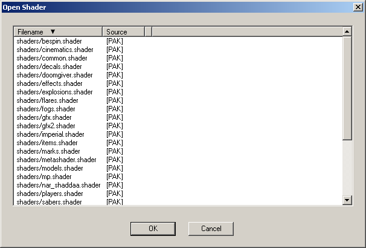

# Setting Up Q3ASE

Q3ASE stands for "Quake 3 Arena Shader Editor". As you can see from the name, it is a program that was developed for Quake 3 Arena, which is why it unfortunately does not know the newer shader commands that the extended Quake Engine of the Jedi Knight series provides. Nevertheless, it is a very good program that has some advantages over the shader editor from the Jedi Knight SDK. It is clearer and easier to use and has a live 3D preview, even on your own 3D objects if you wish.

## Goal

In this tutorial you will download, install and set up Q3ASE.

## Prerequisites

- [Q3ASE](http://www.radiant.robotrenegade.com/downloads/tools/Q3ASE%201.5.3.zip)
- A file archiver like [7-Zip](http://www.7-zip.org/)

## Steps

1. [Download and Unpack Q3ASE](#download-and-unpack-q3ase)
2. [Running Q3ASE for the First Time](#running-q3ase-for-the-first-time)
3. [Adding PK3 Files](#adding-pk3-files)
4. [Checking the Settings](#checking-the-settings)

### Download and Unpack Q3ASE

You cannot download the current version of Q3ASE from the official homepage anymore. As it is no longer being developed, this is version 1.5.3. Download it from an [alternative source](http://www.radiant.robotrenegade.com/downloads/tools/Q3ASE%201.5.3.zip) instead. Now unzip the file *q3ase 1.5.3.zip* with an archiver into a folder of your choice. I have extracted it to *C:\Tools\q3ase*.

### Running Q3ASE for the First Time

Now start the *q3ase.exe*. A window will open in which you can safely click *Yes*, as long as you have a better graphics card than a 3dFX. But you have one, otherwise you could hardly play JK2 smoothly.

This window will appear next:

Click *OK*, because that is exactly what we want. Q3ASE can read \*.pk3 files. To work properly, Q3ASE needs the *q3ase.pk3* file, which should be in the same folder as Q3ASE. Q3ASE already suggests its directory. Simply select the *q3ase.pk3* file and click on *Open*.

If the *q3ase.pk3* file is not in this directory, you may have extracted it somewhere else. In any case, it is included with the *q3ase 1.5.3.zip* file.

### Adding PK3 Files

We now have 2 open windows. One shows the Q3ASE logo and the other looks like this:

So that we can now also edit the original JK2 shaders, we must give Q3ASE the path to the *assets0.pk3* file - in which the JK2 shaders are located. To do this, we click on *File* -> *Edit Pakfiles...* whereupon this window opens:

- *Add PAK...* Adds a new \*.pk3 file
- *Add Directory...* Adds an entire folder like *base/shaders*
- *Remove* Deletes the entry selected in the dialog
- *OK* Closes the dialog

We select *Add PAK...* and navigate to our *assets0.pk3* file, which is located by default in *C:\Program Files\LucasArts\Star Wars JK II Jedi Outcast\GameData\base*. Select it and click on *Open*. You will now see a new entry in the PakFiles dialog. You can now click *OK*.

### Checking the Settings

If you have done everything correctly up to this point, you should see this dialog with the JK2 shaders under *File* -> *Open...*:

Congratulations! You have successfully set up Q3ASE!

*[Q3ASE]: Quake 3 Arena Shader Editor
*[SDK]: Software Development Kit